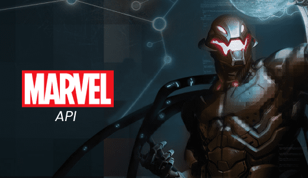
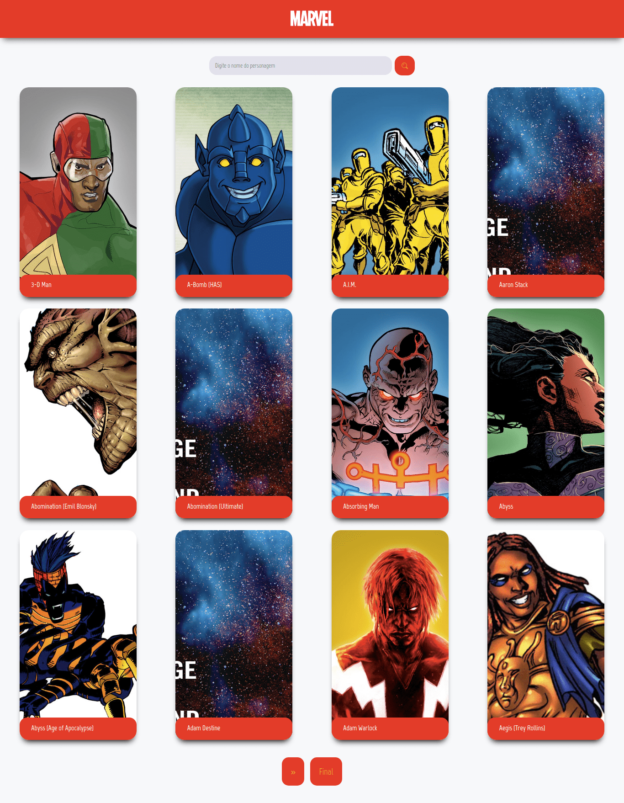

## MARVEL API

[](https://github.com/thalesousa)
[](#)
[](https://github.com/thalesousa/podcastr/stargazers)



## Marvel API search characters.



## Tecnologies


This project was developed using cutting edge front-end technologies.


- [ReactJS](https://reactjs.org/)
- [Typescript](https://www.typescriptlang.org/)
- [Next.js](https://nextjs.org/)

## 💻 Getting started

### Requirements

- You need to install both [Node.js](https://nodejs.org/en/download/) and [Yarn](https://yarnpkg.com/) to run this project.

**Clone the project and access the folder**

```bash
$ git clone https://github.com/Thalesousa/challenge-marvel-beta-sistemas.git && cd challenge-marvel-beta-sistemas
```

**Follow the steps below**

```bash
# Install the dependencies
$ yarn

# Run the web server
$ yarn dev
```

The app will be available for access on your browser at `http://localhost:3000`

## 📝 License

This project is licensed under the MIT License - see the [LICENSE](LICENSE) file for details.

---

Made with ❤️ by Thales Sousa 👋 [Check out my LinkedIn](https://www.linkedin.com/in/thalesousa)
